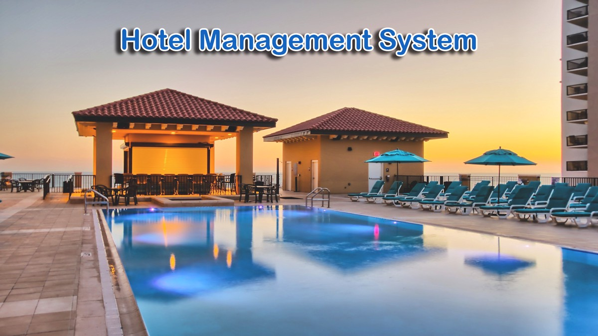

# Hotel_management_system

## Introduction:

The Hotel Management System in PHP is a small project developed using Laravel framework and PHP, JavaScript, Bootstrap, html and CSS. The project contains an admin side. The admin side manages all the management like manage bookings, checking profit, payment, adding and deleting rooms etc. The admin has an important role in the management of this website.

###### I will try to include required 11 points here.

1. I used GitHub to store my project code. I also used GitHub action for continuous delivery.

Project source code: https://github.com/RKMAMUN/Hotel_management_system/tree/main/Project

Project UI Screenshot: https://github.com/RKMAMUN/Hotel_management_system/tree/main/User%20Interface

<b>2. UML stands for Unified Modeling Language,</b> which is a graphical language used to model and describe software systems. UML provides a standardized way of visualizing the design of a software system, including its structure, behavior, and interactions between objects. UML diagrams can be used to model various aspects of a software system, including Class diagrams, which model the classes, attributes, and methods of a system, and the relationships between them.

Class Diagram: https://github.com/RKMAMUN/Hotel_management_system/blob/main/11%20Points/2/HMS_Class_Diagram.JPG

Use Case Diagram:https://github.com/RKMAMUN/Hotel_management_system/blob/main/11%20Points/2/HMS_use_case_diagram.JPG

Activity Diagram: https://github.com/RKMAMUN/Hotel_management_system/blob/main/11%20Points/2/activity_diagram.JPG

<b>3. Domain-Driven Design (DDD)</b> is an approach to software development that focuses on modeling the core business concepts and processes in a software system. DDD is based on the idea that the most important aspect of software design is understanding the problem domain, and that this understanding should be the driving force behind the design and development of the software.

My DDD: https://github.com/RKMAMUN/Hotel_management_system/blob/main/11%20Points/3/DDD.JPG

<b>4. SonarCloud</b> is a cloud-based platform for continuous code quality analysis and improvement. It is part of the SonarQube family of tools, which provide a comprehensive solution for managing code quality, security, and technical debt. I used SonarCloud for my project. Please, have a look at the provided links below:

https://sonarcloud.io/summary/new_code?id=RKMAMUN_Hotel_management_system

<b>5.Clean Code Development:</b> Clean code refers to code that is well-organized, readable, maintainable, and easy to understand. It follows best practices, coding standards, and design patterns to ensure that the code is of high quality.

In my project I tried to follow clean code.
Here is my clean code points:
 1. Commenting where needed
 2. Proper naming of variables and functions
 3. Proper naming of files
 4. Avoiding repeat
 5. Standard formatting implemented
 6. No useless variables or functions defined

I have also some screenshot as cheat sheet
https://github.com/RKMAMUN/Hotel_management_system/blob/main/11%20Points/5/Cheat%20Sheet.pdf

<b>6. Build management</b> for PHP refers to the process of automating the build and deployment of PHP applications. This involves managing the build environment, defining build processes, and automating build and deployment tasks. The goal of build management for PHP is to streamline the development process, reduce errors, and increase efficiency.
 
I used “npm run dev” to build my project. The build folder is then used to deploy my project. “npm run dev” does nothing. “npm run dev” produces a build directory containing a production build.

https://github.com/RKMAMUN/Hotel_management_system/blob/main/Project/package-lock.json

<b>7. Unit testing</b> is a software testing technique in which individual units or components of a software application are tested in isolation from the rest of the application. The goal of unit testing is to validate that each unit or component of the application works as intended, and to detect and prevent bugs early in the development process. This can help to reduce the overall cost and time required to deliver a quality product.
Unit tests are typically automated and are run frequently during the development process, such as after each change to the code or at least once a day. They are written by developers as part of the development process, and they provide a fast and efficient way to validate that the code works as expected.

some example of tests:
1. https://github.com/RKMAMUN/Hotel_management_system/blob/main/11%20Points/7/reserve_room_test.php
 
The test uses the assertTrue method to verify that the reserveRoom method returns true, indicating that the room was successfully reserved. It then uses the    assertFalse method to verify that the checkAvailability method returns false, indicating that the room is no longer available.

2. https://github.com/RKMAMUN/Hotel_management_system/blob/main/11%20Points/7/room_management_test.php
The testAddRoom method tests the addRoom method by adding a room and verifying that it can be retrieved using the getRoom method.
The testUpdateRoom method tests the updateRoom method by adding a room, updating its information, and verifying that the updated information is returned by the getRoom method.

3. https://github.com/RKMAMUN/Hotel_management_system/blob/main/11%20Points/7/Complain_controller_test.php

The testComplainMethod method tests the complain method by making a GET request to the complain route and verifying that the correct view is returned.
The testGetComplainMethod method tests the getcomplain method by creating 5 complain records, making a GET request to the getcomplain route, and verifying that the correct number of records is returned.
The testResolveMethod method tests the resolve method by creating a complain record, making a PUT request to the resolve route with the id and budget parameters, and verifying that the correct values are updated in the database.

8. Continuous delivery is a software development practice where code changes are automatically built, tested, and deployed to production. This can be achieved through the use of a continuous delivery pipeline, which automates the process of building, testing, and deploying code changes.

https://github.com/RKMAMUN/Hotel_management_system/blob/main/.github/workflows/laravel.yml

<b>9. I used PhpStorm.</b> PhpStorm is a popular Integrated Development Environment (IDE) for PHP development. It provides a wide range of features and tools to help developers write, debug, and maintain their code efficiently.

My favorite shortcuts are: 
Ctrl+ E - toggle between recently used files 
Ctrl + / - comment/uncomment a block of code 
Ctrl + B - go to the class declaration 
Ctrl + N - navigate to class 
Ctrl + R - search and replace 
Ctrl +Alt + L - reformat code 
Alt + Enter - show intention actions and quick-fixes 
Ctrl + Shift + Enter - complete statement 

<b>10. A domain-specific language (DSL)</b> is a programming language that is tailored to a specific application domain, rather than being a general-purpose language that can be used for any kind of software development. A DSL is designed to make it easier to specify the operations and rules that are specific to a particular domain, and it often provides a higher level of abstraction than a general-purpose language. This makes DSLs more concise, expressive, and easier to understand for people who are experts in the target domain.
 

Here's a small example of a Domain-Specific Language (DSL) in PHP: 
https://github.com/RKMAMUN/Hotel_management_system/blob/main/11%20Points/10/DSL.php 

In this example, I have created a PageBuilder class that has methods for building a simple HTML page. The header, content, and footer methods return the corresponding HTML code, and the build method combines these methods to build a complete HTML page. The build method is called with the title and content of the page, and the resulting HTML code is echoed to the screen.
This example demonstrates how a DSL can be used to simplify a complex task by providing a simple and intuitive interface for building HTML pages. By using a DSL, developers can focus on the task at hand, rather than worrying about the underlying HTML code.

I also wrote an example code for email validation check. 
https://github.com/RKMAMUN/Hotel_management_system/blob/main/11%20Points/10/email_validation.php  

This example checks the validity of an email address and prints a message indicating whether the email address is valid or not. This function takes an email address as an argument and returns true if the email address is valid and false otherwise. The regular expression in the function checks the syntax of the email address to make sure that it meets the basic requirements for an email address, such as having a correct format for the username, domain name, and top-level domain.

<b>11. Functional Programming:</b> Functional programming is a programming paradigm that is based on the mathematical concept of functions. In functional programming, functions are treated as first-class citizens, meaning that they can be used just like any other data type in the language, such as numbers or strings.
 
For function as parameter and return value and closure 

https://github.com/RKMAMUN/Hotel_management_system/blob/main/11%20Points/11/reservation.php

For anonymous function: 
https://github.com/RKMAMUN/Hotel_management_system/blob/main/11%20Points/11/staff.php
